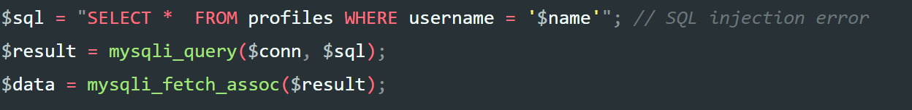
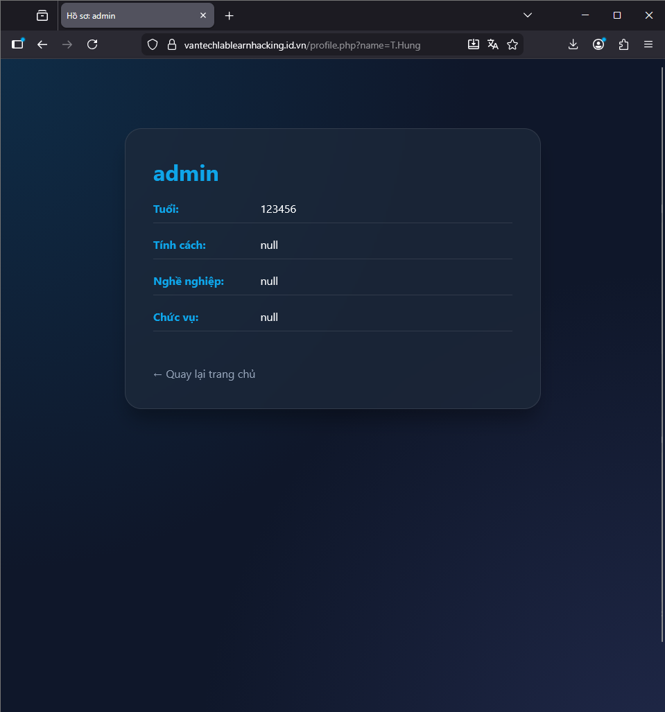

# 🛡️ UNION Based SQL Injection Writeup

### 📖 Overview
A **UNION Attack** is a type of SQL injection where an attacker uses the `UNION` operator to combine the results of the original query with a malicious query. This allows the attacker to retrieve sensitive information from other tables in the database. 🔓

For example, consider a developer using a query like this to fetch user information:



We can inject malicious code into the input field to leak data. For example:

```sql
' UNION SELECT NULL, username, username, password, NULL, NULL, NULL FROM users -- 
```
---

### 🔍 Determining the Number of Columns
A major challenge is knowing exactly how many columns the original query (e.g., for the profile table) is selecting. There are two common tricks to find this:

#### 1️⃣ Using `ORDER BY`
We can use the `ORDER BY` clause to test the column count.
 ```sql
' ORDER BY 1 --
' ORDER BY 2 --
' ORDER BY 3 --
...
```

Increment the number until you receive an **error**. ⚠️ If `' ORDER BY 4` works but `' ORDER BY 5` causes an error, you know the query selects exactly **4 columns**.

#### 2️⃣ Using `UNION SELECT` with NULLs
Alternatively, you can inject `UNION SELECT` statements with varying numbers of `NULL` values:

' UNION SELECT NULL, NULL, NULL -- 

If the number of `NULL`s does not match the original column count, the database will return an error. You keep adding `NULL` parameters until the page loads successfully. ✅

---

### 🧪 Finding Column Data Types
Once you have the column count, you need to find which columns can hold **string** data (so you can display your results). You can test this by replacing each `NULL` with a string value (like 'a') one by one:

```sql
' UNION SELECT 'a', NULL, NULL -- 
' UNION SELECT NULL, 'a', NULL -- 
```

If the page loads without an error, that specific column is compatible with string data. 📝

---

### 🚩 Execution & Results
After identifying the number of columns and their types, you can craft the final payload to extract the data you want.



> **💡 Pro Tip:** It is often important to change the original search term (like 'T.Hung') to a non-existent value. This ensures the original profile information doesn't "clobber" or hide the malicious results you are trying to display.